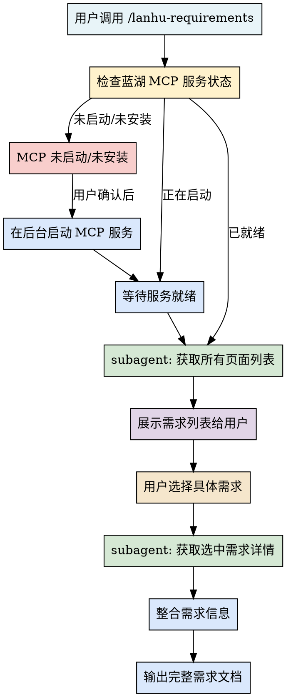

# 蓝湖需求获取工作流

一键启动蓝湖 MCP 服务并获取完整需求文档的标准化工作流。

## 概述

本 skill 提供从 MCP 启动检查、安装引导、subagent 并行获取、需求列表展示、用户选择后完整需求汇报的端到端流程。

## 适用场景

- 开发前需要从蓝湖获取产品需求
- 需要查看蓝湖 Axure 原型页面
- 需要获取设计稿和切图资源
- 团队协作时需要统一的需求来源

## 工作流步骤



## 1. MCP 服务检查与启动

**检查步骤：**

1. 检查 `.omc/mcp/lanhu-mcp/ 目录是否存在
2. 检查 8000 端口是否有服务监听
3. 验证 `curl http://localhost:8000/mcp` 是否返回正确响应

**启动命令：**

```bash
# 检查端口
netstat -ano | grep :8000

# 或启动服务（后台运行）
cd .omc/mcp/lanhu-mcp
python lanhu_mcp_server.py
```

**如果服务未启动时的引导：**

- 目录不存在 → 引导用户从 GitHub 克隆：
  ```bash
  git clone https://github.com/dsphper/lanhu-mcp.git .omc/mcp/lanhu-mcp
  ```

- Cookie 未配置 → 引导用户打开 `.env` 文件配置 `LANHU_COOKIE`

- 依赖未安装 → 引导运行 `pip install -r requirements.txt`

## 2. Subagent 分工模式

**推荐使用两个 subagent 并行工作：**

| Agent 角色 | 职责 | 工具 |
|-----------|------|------|
| **页面获取 Agent** | 调用 `lanhu_get_pages` 获取所有页面列表，按模块分组整理 | `mcp__lanhu__lanhu_get_pages` |
| **需求分析 Agent** | 待用户选择后，调用 `lanhu_get_ai_analyze_page_result` 获取详细需求，整理成开发文档 | `mcp__lanhu__lanhu_get_ai_analyze_page_result` |

## 3. 需求列表展示格式

```
📋 蓝湖需求文档 - 共 N 个页面

| 序号 | 模块 | 需求名称 | 页面数 |
|-----|------|---------|-------|
| 1 | 用户认证 | 登录注册流程 | 3 |
| 2 | 订单管理 | 订单创建与支付 | 5 |
| ... | ... | ... | ... |

请选择需要查看的需求序号（可多选，如 1,3）：
```

## 4. 完整需求输出模板

```
# 【模块名】需求文档

## 📊 需求概览
- 需求名称：xxx
- 所属模块：xxx
- 页面数量：N
- 更新时间：xxx

## 🎯 核心功能点
1. ...

## 📝 字段规则表
| 字段名 | 必填 | 类型 | 校验规则 | 错误提示 |

## 🔄 业务流程图
[流程图描述...

## ⚠️ 待确认事项
- ...

## 📎 相关资源
- 原型链接
- 设计稿链接
```

## 5. 与开发视角分析模式

用户选择需求后，必须询问分析视角：

```
请选择分析视角：
1. 【开发视角】- 字段规则、业务逻辑、接口依赖、数据库设计建议
2. 【测试视角】- 测试场景、边界值、校验规则、联调清单
3. 【快速探索】- 核心功能概览、模块依赖、开发顺序建议
```

## Quick Reference

| 操作 | 工具/命令 |
|------|----------|
| 检查服务 | `curl http://localhost:8000/mcp |
| 启动服务 | `python .omc/mcp/lanhu-mcp/lanhu_mcp_server.py` |
| 获取页面列表 | `mcp__lanhu__lanhu_get_pages` |
| 获取需求详情 | `mcp__lanhu__lanhu_get_ai_analyze_page_result` |

## 常见问题

**Q: MCP 服务启动失败怎么办？**
A: 检查：1) Python 版本 ≥ 3.10，2) 依赖已安装 `pip install -r requirements.txt`，3) `.env` 中的 `LANHU_COOKIE` 已配置

**Q: 页面加载很慢怎么办？**
A: 首次加载需要时间，等待 10-30 秒后重试

**Q: 如何配置蓝湖 Cookie？**
A: 参考 `.omc/mcp/lanhu-mcp/GET-COOKIE-TUTORIAL.md`

## 调用示例

```
用户：/lanhu-requirements
→ 检查 MCP 服务
→ 启动服务（如未启动）
→ 获取页面列表
→ 展示需求列表给用户选择
→ 用户选择后获取详情
→ 输出完整需求文档
```
